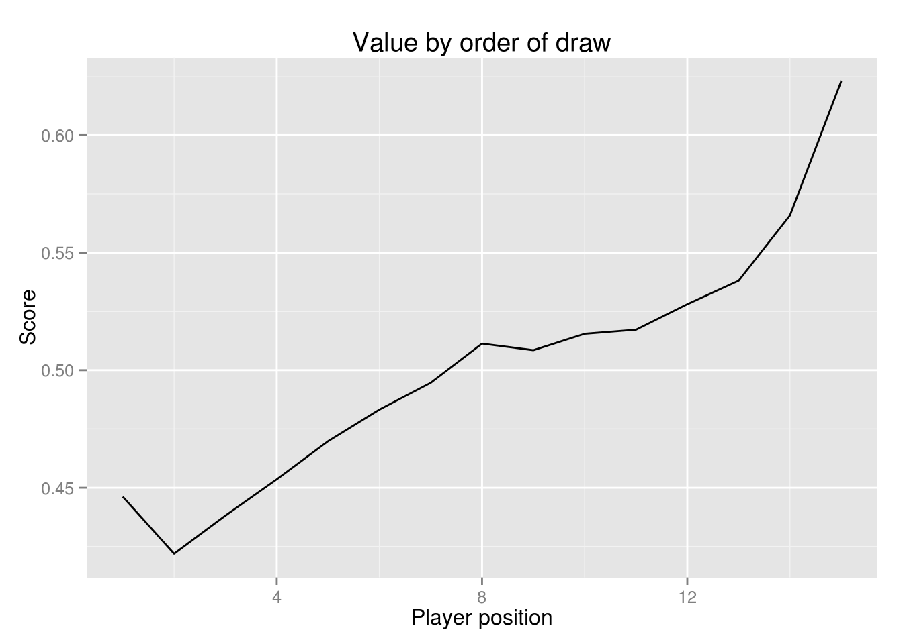
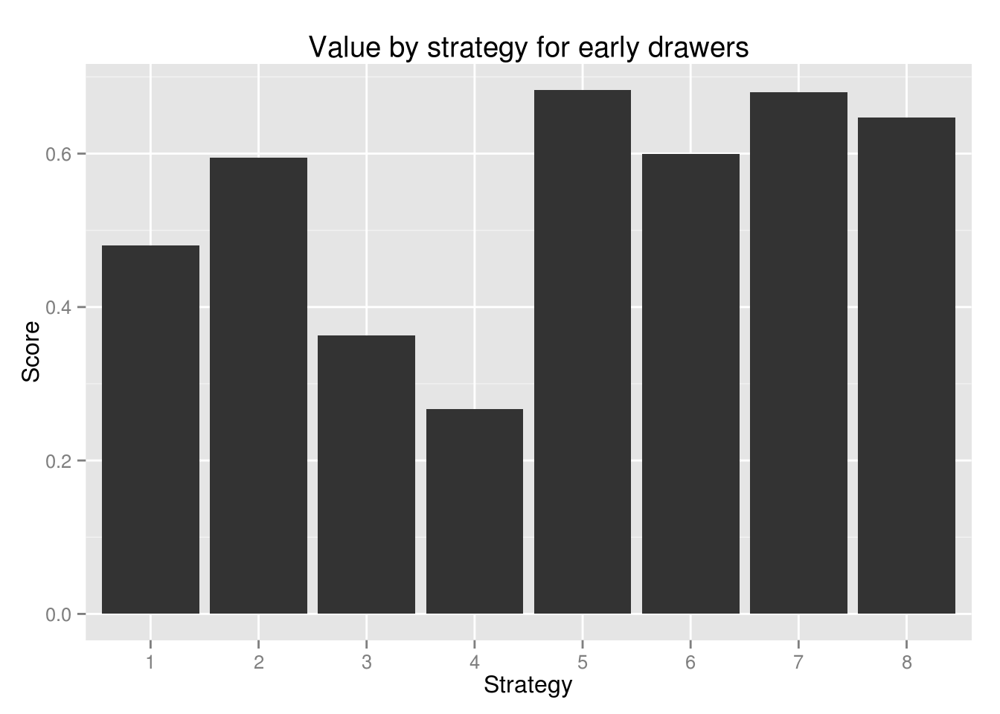
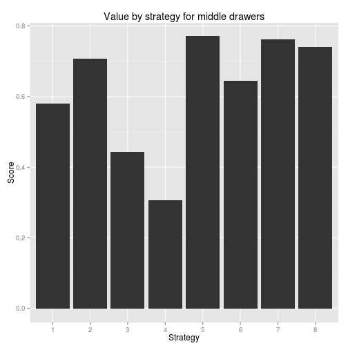
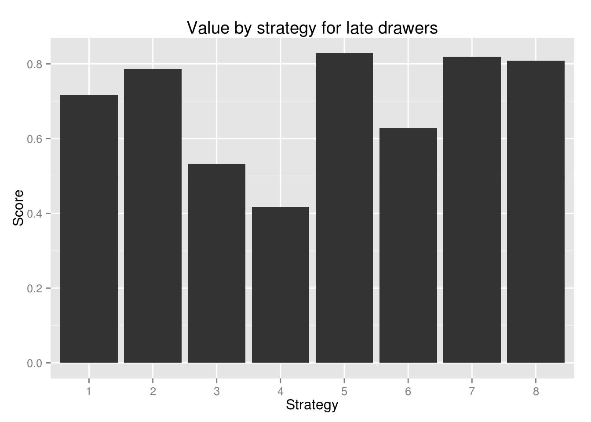

# The Game Theory of the Yankee Swap

### Introduction
What is the best strategy for a Yankee Swap (also known as a white elephant exchange)? This model attempts to use game theory to find the answer.

For a story and video based on this analysis, see [here](http://fivethirtyeight.com).

**Note:** There are two versions of this repo:

- The version at <https://github.com/fivethirtyeight/> is a static rep reflecting the model at the time of publication.
- The version at <https://github.com/BenCasselman> is an active repo and will reflect any later updates or additions.

This model is inspired partly by [this approach](https://github.com/analyzestuff/posts/blob/master/white_elephant/white_elephant.R) by Max Ghenis. Thanks also to Max for providing some helpful coding suggestions.

Comments/questions/feedback? [email me](mailto:ben.casselman@fivethirtyeight.com)

### Rules and Assumptions
There are endless variations of the game, some of which have significant strategic implications. The optimum strategy also depends heavily on underlying assumptions about how different players value each gift, and how well they can estimate those values.

##### The rules of Yankee Swap used here:
- N players each bring one gift
- Each round, a player can choose to pick a new gift or steal someone else's gift.
- If a person steals a gift, the steal-ee makes the same choice. (See code for `variant.R` to see an alternate version of this rule.)
- Players can't immediately "steal back" a gift that was just taken from them.
- Gifts can not be stolen more than a fixed number of times each.
- OPTIONAL RULE: The first player gets a final turn at the end. Can set this by toggling value of `extra` in the code.

##### A few assumptions:
- Gifts have an underlying value that is the same for all players (but not known to them).
- Gifts have a specific value to each individual player (based on the underlying value).
- Players can perfectly assess a gift's value to them, but NOT the underlying value (might be interesting to play with this assumption).
- Goal for each player is to maximize value of final gift.

##### This model tests eight strategies:
1. Player steals with probability p = (number of gifts taken) / N (naive)
2. Player always steals most valuable gift available
3. Player always steals second-most-valuable gift available (if only one gift is available, player steals that one)
4. Player never steals
5. Player steals if any stealable gift has value (to them) greater than estimated underlying value of average gift
6. Player steals about-to-be unstealable gift if one available greater than estimated underlying value of avg gift
7. Same as #5 but factor in knowledge of gift player brought.
8. Ghosh-Mahdian: Player steals if best available gift has value > $\theta$

**Note:** Stragy #8 is based off the approach developed by Arpita Ghosh and Mohammad Mahdian in [this paper](http://www.arpitaghosh.com/papers/gift1.pdf). 
Player steals if value of best available gift exceeds $\theta$, where $\theta_i =  \theta_{i-1} - \frac{\theta_{i-1}^{2}}{2}$ 

### Model Design
The model allows the user to adjust five variables, with the following presets:


```r
n.play <- 15 # Number of players
max.steals <- 3 # Maximum number of times a gift can be stolen
v <- .9 # How much variance is there in how different players assess value of gifts?
iterations <- 10000 # How many iterations.
extra <- FALSE # Does first person get an extra shot at the end?
```

The model randomly assigns:

- A strategy (1-8) to each model;
- An underlying value (between 0 and 1, evenly distributed) to each gift;
- A player-specific value for each player-gift combo, using the following formula:

```r
  values <- data.frame(gifts = 1:n.play)
  for (i in 1:n.play){
    values[c(i + 1)] <- sapply(gifts$underlying.value, function(x) x * runif(1, min= 1 - v, max = 1 + v))
    names(values)[i + 1] <- paste0("player_", i)
  }
```


### Analysis
A few clear takeaways quickly emerge. (Charts are based on 10,000 iterations using default parameters, unless otherwise indicated.)

##### Player order
There is a big advantage to going later, and a particularly large advantage to going last. (Going first also seems to be slightly better than going second.)

 

##### Strategy
Strategy matters! Specifically:

- Never stealing is a terrible strategy;
- So, somewhat surprisingly, is the "take the second best" strategy;
- Strategies based on the expected value of unopened gifts (5,7 and 8) perform best, but;
- The simple "always steal" does surprisingly well;
- There is little difference in outcome between models 5 and 7.

 

We can see this using a regression analysis, controlling for player order:

```r
regress <- lm(result ~ factor(strategy) + player.no, data = cumulative)
summary(regress)
#> 
#> Call:
#> lm(formula = result ~ factor(strategy) + player.no, data = cumulative)
#> 
#> Residuals:
#>      Min       1Q   Median       3Q      Max 
#> -0.86443 -0.29943 -0.06231  0.26220  1.56237 
#> 
#> Coefficients:
#>                     Estimate Std. Error t value Pr(>|t|)    
#> (Intercept)        0.4669372  0.0035412 131.857  < 2e-16 ***
#> factor(strategy)2  0.1036638  0.0041934  24.721  < 2e-16 ***
#> factor(strategy)3 -0.1461534  0.0041926 -34.860  < 2e-16 ***
#> factor(strategy)4 -0.2628889  0.0041710 -63.028  < 2e-16 ***
#> factor(strategy)5  0.1683386  0.0041972  40.107  < 2e-16 ***
#> factor(strategy)6  0.0321154  0.0041963   7.653 1.97e-14 ***
#> factor(strategy)7  0.1608120  0.0041838  38.437  < 2e-16 ***
#> factor(strategy)8  0.1396575  0.0041832  33.385  < 2e-16 ***
#> player.no          0.0157172  0.0002427  64.769  < 2e-16 ***
#> ---
#> Signif. codes:  0 '***' 0.001 '**' 0.01 '*' 0.05 '.' 0.1 ' ' 1
#> 
#> Residual standard error: 0.406 on 149991 degrees of freedom
#> Multiple R-squared:  0.1365,	Adjusted R-squared:  0.1364 
#> F-statistic:  2963 on 8 and 149991 DF,  p-value: < 2.2e-16
```

Strategy is less important earlier in the game. Here are the same strategy-payoff charts for early (players 1-5), middle (6-10) and late (11-15) players.

   

This can be tested formally by adding an interaction term between player order and strategy (results omitted for space):

```r
regress <- lm(result ~ factor(strategy) * factor(player.no), data = cumulative)
summary(regress)
```


##### Other notes & future analysis
- Changing variance of preferences affects shape but not overall takeaway. The greater the variation,the more important both strategy and player order become.
- Allowing gifts to be swapped more times makes the game take forever but doesn't change overall outcomes. (Allowing unlimited swaps can turn into a literally unending game if no other stop-points are built in.)
- The `extra <- TRUE` option, in which the first player gets an extra turn, gives a massive advantage to going first. It's actually much *less* fair than the default rules.
- Choice of strategy matters much less in the `variant.R` model, in which a stealee **must** open (no chains of steals). The relative ranking of the strategies changes little, however, with the exception that strategy #3 (steal the 2d best gift) performs far better under the alternative rules.
- It would be interesting to test a model in which players are able to estimate each other's preferences and adjust their strategy accordingly.
- It would also be interesting to test each strategy against the naive strategy (i.e. every player except one plays strategy #1).
